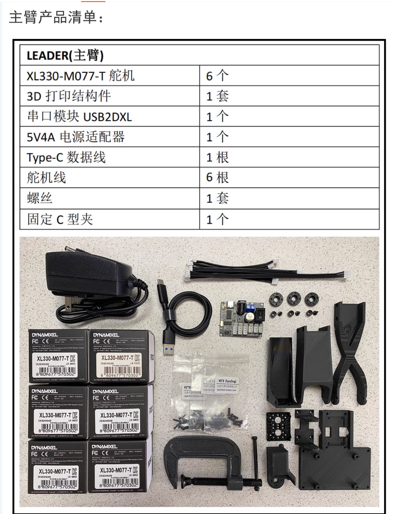
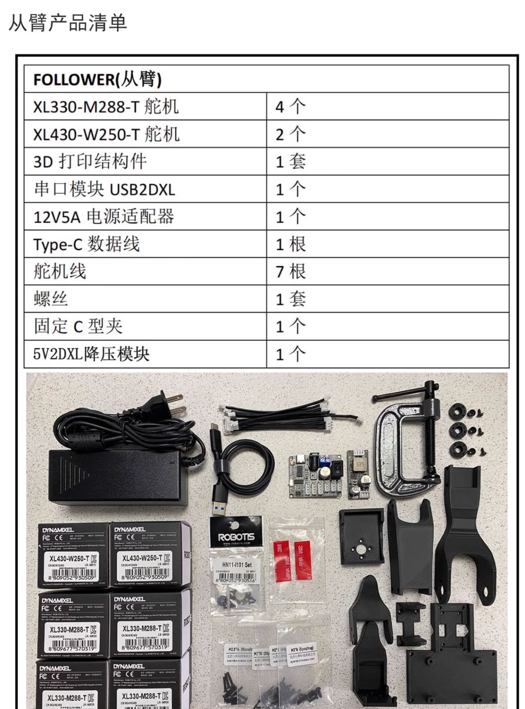
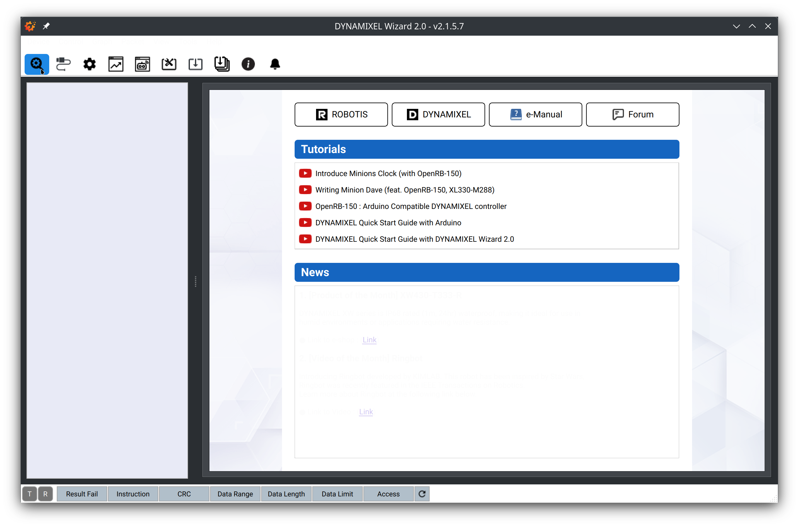
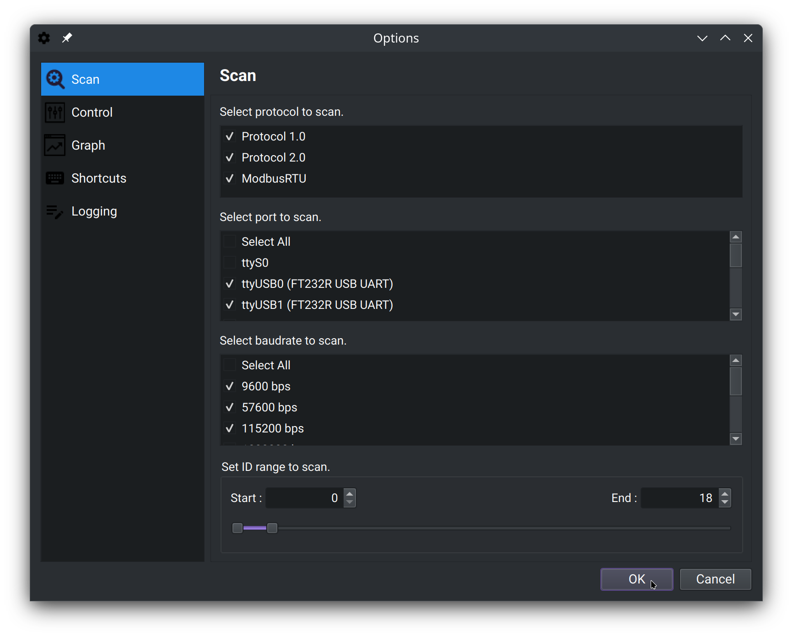
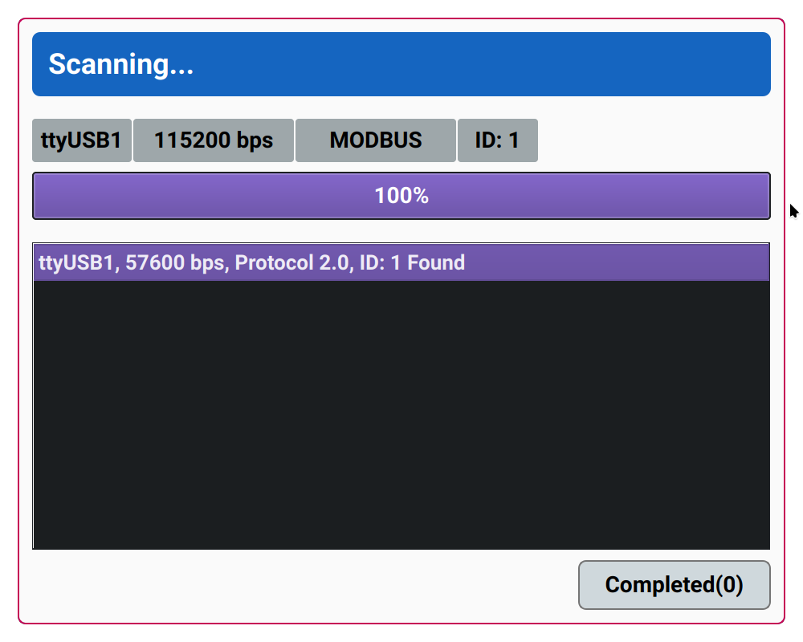
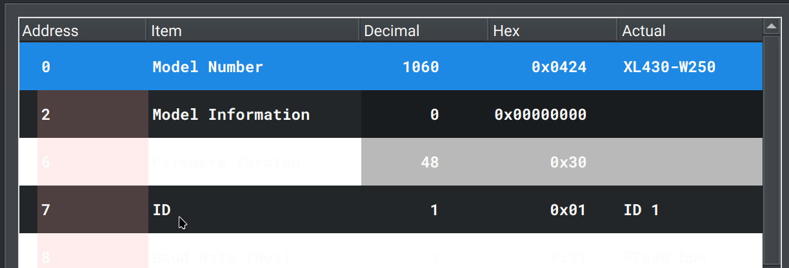
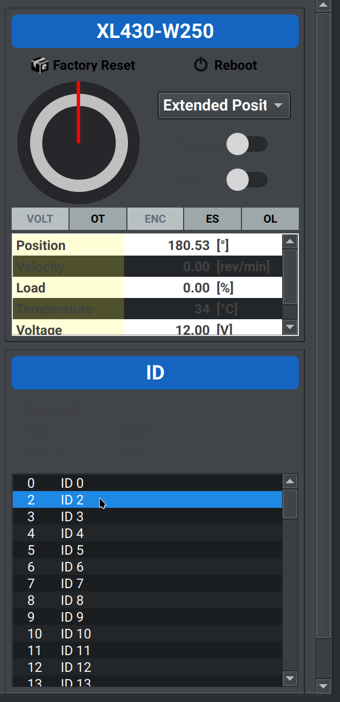
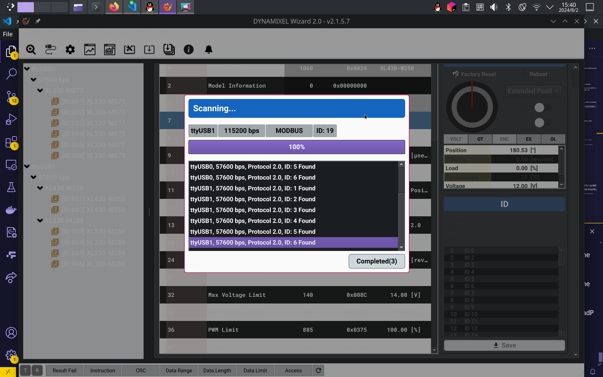
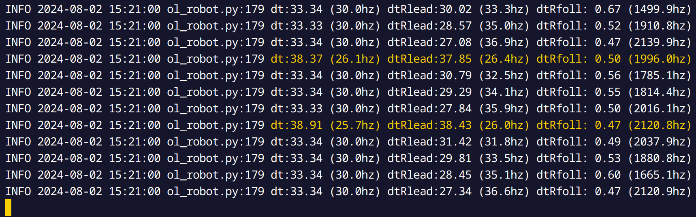

# Quick Start

## Installation

以下操作请在Linux环境下进行，推荐`Ubuntu 20.04`及以上，`CentOS 8`及以上，`openEuler 22.03 LTS`及以上或`Arch Linux`等，内核版本大于等于`5.5`，可通过```uname -a```命令查看系统内核版本。

将本仓库克隆到本地，```cd```到所克隆的仓库目录并安装依赖，在此之前请确保系统中已安装miniconda或者anaconda并激活环境：

```bash
conda create -n lerobot python=3.10
pip install mujoco opencv-python dynamixel_sdk
pip install '.[aloha]'
```

## Hardware Setup

### 硬件采购

请组装好机器人。在默认配置中，主动臂与从动臂分别为Koch机器人，其硬件配置如下：

- 主动臂：有六个关节，每个关节可驱动一个Dynamixel XL330舵机，接5V电源。
    - 硬件需求：
        - 舵机：6个Dynamixel XL330-M077舵机，每个舵机之间首尾相连，其中有一根电源线接5V电源。
        - 电源：电源线，5V电源或其适配器。
        - 其他：控制主机、导线、3D打印机械臂等
- 从动臂：有六个关节，每个关节可驱动一个Dynamixel XL430或XL330舵机，接12V电源。
        - 舵机：2个Dynamixel XL430-W250舵机，4个Dynamixel XL330-M288舵机，外加变压转换器，舵机之间首尾相连，顺序为：
            - 第一个XL430舵机接12V电源，第二个XL430舵机接变压转换器**输入端**（请勿接反）。
            - 第一个XL330舵机接变压转换器**输出端**，其他XL330舵机首尾相连。
        - 电源：电源线，12V电源或其适配器。
        - 其他：控制主机、导线、3D打印机械臂等

以下为参考图：
- 主臂：

- 从臂：


组装视频：https://www.bilibili.com/video/BV1pevKeqEsT

要保证机器人能够正常工作，请确保电源线、舵机、机械臂、控制主机、导线、机械臂等各个部件的装配与连接正确无误。

### ID配置

下载```DYNAMIXEL Wizard```软件，[下载链接在此处](https://emanual.robotis.com/docs/en/software/dynamixel/dynamixel_wizard2/)，**将一个舵机单独直接连上板子**，请注意**一次只连一个**，且**注意5V与12V舵机的区别**，接上主机。

```DYNAMIXEL Wizard```软件安装后打开：



点击图左上方齿轮图标，设置扫描参数如下：



点击图左上方的放大镜图标进行扫描：



根据接入顺序，可能是`/dev/ttyUSB0`或`/dev/ttyUSB1`，若扫描到结果如上图即成功。此窗口会自动关闭。

点击中间如图所示：



点击右侧栏ID选项，可设置ID。



向下滑动滚轮，可看到`Save`，保存即可。

依次操作，将两个机械臂分别进行1到6编号。

最后两个机械臂接上，扫描一下：



若得到如图所示效果，则配置成功。

## Configuration

请在```lerobot/common/robot_devices/robots/factory.py```与```lerobot/common/robot_devices/robots/koch.py```文件中配置机器人参数。

### 机器人硬件参数配置

请在[```lerobot/common/robot_devices/robots/factory.py```](../lerobot/common/robot_devices/robots/factory.py)文件第9行至第42行配置机器人硬件参数：

```python
robot = KochRobot(
    leader_arms={
        "main": DynamixelMotorsBus(
            port="/dev/ttyUSB0",
            motors={
                # name: (index, model)
                "shoulder_pan": (1, "xl330-m077"),
                "shoulder_lift": (2, "xl330-m077"),
                "elbow_flex": (3, "xl330-m077"),
                "wrist_flex": (4, "xl330-m077"),
                "wrist_roll": (5, "xl330-m077"),
                "gripper": (6, "xl330-m077"),
            },
        ),
    },
    follower_arms={
        "main": DynamixelMotorsBus(
            port="/dev/ttyUSB1",
            motors={
                # name: (index, model)
                "shoulder_pan": (1, "xl430-w250"),
                "shoulder_lift": (2, "xl430-w250"),
                "elbow_flex": (3, "xl330-m288"),
                "wrist_flex": (4, "xl330-m288"),
                "wrist_roll": (5, "xl330-m288"),
                "gripper": (6, "xl330-m288"),
            },
        ),
    },
    cameras={
        "top": OpenCVCamera(0, fps=30, width=640, height=480),
        # "phone": OpenCVCamera(1, fps=30, width=640, height=480),
    },
)
```

其中：
- ```leader_arms```参数为主动臂参数，```follwer_arms```参数为从动臂参数。
- ```port```参数为串口号，指代的是Linux下USB串口设备文件，如```/dev/ttyUSB0```。
    请使用前再三确认其是否对应，主动臂与从动臂不可弄反，可通过接入的先后顺序来判断分别为哪一个设备文件。运行程序前请确保串口设备文件存在，否则可能导致程序无法正常运行，并运行```sudo chmod 666 /dev/ttyUSB0```命令赋予串口设备文件权限。
- ```motors```参数为机械臂的索引号和型号，如```(1, "xl330-m077")```。
    第一个数为索引号，第二个数为机械臂型号，请根据实际情况填写，如有机械臂型号不同，请务必对应进行修改。
- ```cameras```参数为相机的索引号和参数，可更改其帧率与分辨率，建议其配置至少在代码此处所给出的默认配置，勿自行降低。

### 机器人串口通讯配置

请在[```lerobot/common/robot_devices/motors/dynamixel.py```](../lerobot/common/robot_devices/motors/dynamixel.py)文件第24行进行配置。

此处只需配置波特率，代码如下：

```python
BAUD_RATE = 57600
```

默认为`57600`，请根据实际情况进行修改。

## Running the Demo

请运行control_robot.py进行测试：

```bash
python lerobot/scripts/control_robot.py teleoperate --fps 30
```

其中```teleoperate```为控制模式，```--fps```为帧率，可根据机器人性能调整。

运行成功后，控制台将滚动输出，如图所示：



操控主动臂，可看到从动臂也跟着调整姿态。

倘若此处遇到问题，请仔细审查前面步骤是否正确完成与配置。

## Recording Dataset

请确认是否正确连接摄像头，并采用OpenCV自行调用摄像头进行测试。[这里有一个脚本](../lerobot/scripts/test_opencv.py)，可自行编辑后```python lerobot/scripts/test_opencv.py```调取画面；并调整角度，清理摄像头所拍到的视野无遮挡物。

若摄像头连接正确，则可进行数据集录制。

数据集若过大则可能出现程序闪退，从而导致此前的录制数据丢失，所以请注意控制数据集大小或选择运行内存更大的电脑（推荐32G及以上）。

您也可登录注册`huggingface`账户，并进行`huggingface-cli login`登录，配置具有读写权限的API KEY，然后运行以下命令进行数据集录制：

```python
python lerobot/scripts/control_robot.py record_dataset \
    --fps 30 \
    --root data \
    --repo-id $USER/koch_pick_place_lego \
    --num-episodes 100 \
    --run-compute-stats 1 \
    --warmup-time-s 2 \
    --episode-time-s 20 \
    --reset-time-s 10
```

录制完成后查看：

```bash
python lerobot/scripts/control_robot.py replay_episode \
    --fps 30 \
    --root tmp/data \
    --repo-id $USER/koch_test \
    --episode 0
```

## Training

请确保你拥有一台显存18GB及以上显卡、至少32GB的运行内存与至少16核心处理器的x86_64架构计算机，将您的lerobot整体打包备份过去，使用相同的方式进行环境配置，并保证您已登陆huggingface账户并配置好API KEY。

运行Training脚本：

```bash
DATA_DIR=data python lerobot/scripts/train.py \
    policy=act_koch_real \
    env=koch_real \
    dataset_repo_id=$USER/koch_pick_place_lego \
    hydra.run.dir=outputs/train/act_koch_real
```
